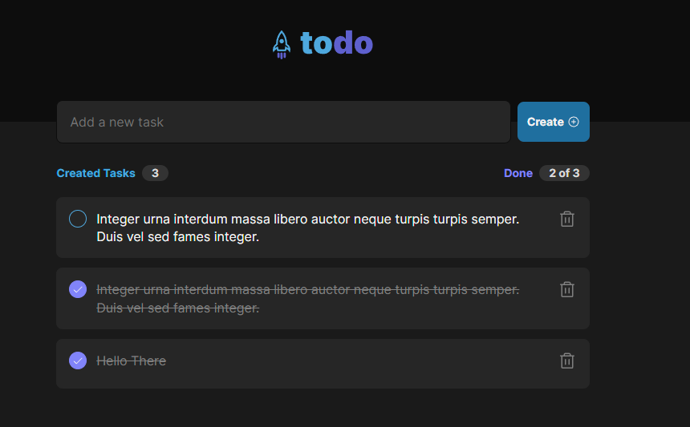

<p align="center">
  
</p>

<p align="center">
    <strong>ToDo List Web Application.</strong>
</p>

<p align="center">
  
  
  
  
</p>

<p align="center">
 <a href="#-About">About</a> •
 <a href="#-Functionalities">Functionalities</a> • 
 <a href="#-layout">Layout</a> • 
 <a href="#-Technologies">Technologies</a> • 
 <a href="#-Installation">Installation</a> • 
</p>

## 💻 About

Small application with the basic elements for a React Application, by adding, removing and updating ToDo tasks in a list of items.

<p align="center">
  
</p>


## ☑ Functionalities

- [x] Add ToDo Tasks
  - [x] Add with Enter
  - [x] Check empty fields
- [x] Change ToDo task status
  - [x] Set as Done
  - [x] Delete ToDO
- [x] Responsiveness for Mobile Devices

## 🎨 Layout

### Figma File

[Figma Mock](https://www.figma.com/file/0n0zDN7zbzhRbaEO74Xesx/ToDo-List/duplicate)

## 🔨 Technologies

The following framworks/libraries were used for this project:

- **[ReactJS](https://reactjs.org/)**
- **[TypeScript](https://www.typescriptlang.org/)**
- **[Sass](https://sass-lang.com/)**
- **[Vite](https://vitejs.dev/)**

> Check the full [package.json](https://github.com/flavioccf/react_ignite_challenge_01/blob/main/package.json)


## 🚀 Installation

```bash
# Clone the repo
git clone https://github.com/flavioccf/react_ignite_challenge_01.git

# Access the project
cd react_ignite_challenge_01

# Install dependencies
npm install

# Run the application
npm run dev

# The server will start - port:3000 - acesse http://localhost:3000
```
